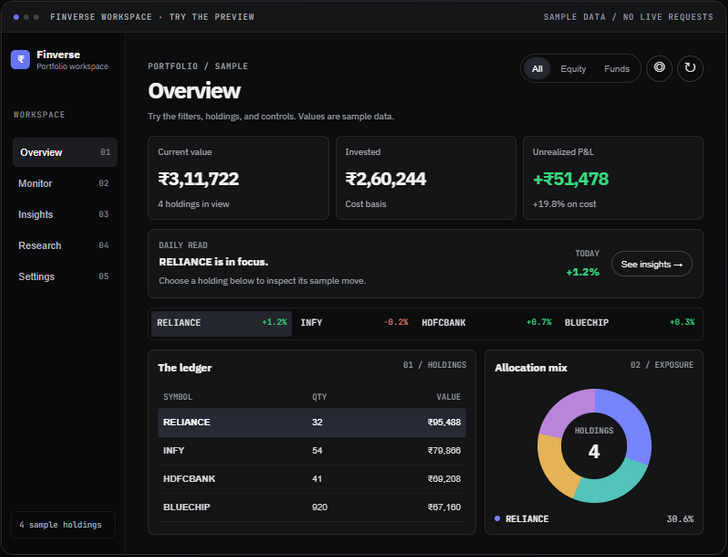
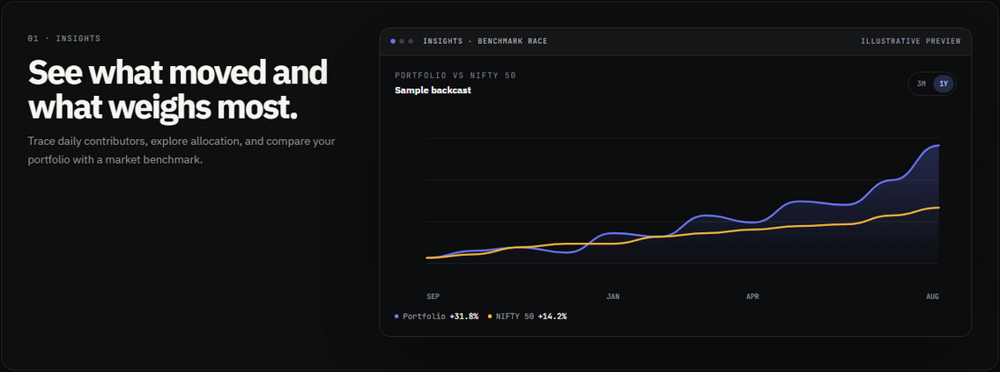

# Finverse

Know what you own. See what moves.

Finverse brings equities, ETFs, and mutual funds into a private portfolio workspace. Import your holdings, see the whole picture, then follow a move down to the holding behind it.



Import `.xlsx`, `.xls`, or `.csv` files as separate folios. Review value, cost, P&L, and allocation; explore holding history, daily movers, portfolio news, and market comparisons.



The screenshots use sample data. Historical backcasts apply current holdings to past prices; daily snapshots build a tracked record from the day they begin.

## Run locally

```bash
npm install
npm run dev
```

Open the local URL printed by Vite. Run `npm run build` to check and build the app.

## Your data

No account is required. Holdings stay in your browser. External market data is optional and sends instrument identifiers to providers when enabled.
