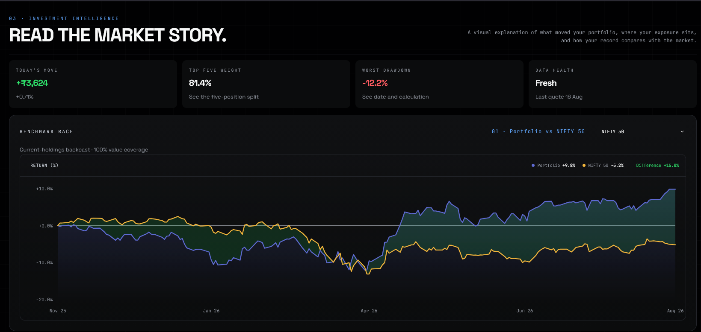

# Finverse

Finverse is a private, client-side investment tracker for understanding a portfolio at a glance. Import your holdings, follow live prices, explore allocation and risk, compare your portfolio with market benchmarks, and ask an AI assistant questions about your investments.



## What you can do

- Import `.xlsx`, `.xls`, or `.csv` holdings into separate folios.
- Review invested capital, current value, P&L, XIRR, and holding-level details.
- Explore allocation through an interactive treemap and sector/type mix.
- See which holdings helped or hurt today’s portfolio movement.
- Compare portfolio performance with Indian and global benchmarks.
- Understand drawdown, volatility, concentration, and recovery distance.
- Track individual holding price or NAV history.
- Use the AI assistant with your selected provider and model.
- Export portfolio data and undo the latest import.

## Investment Intelligence

The Insights view is designed to answer four practical questions:

1. What changed today?
2. Where is my portfolio concentrated?
3. How is it behaving relative to the market?
4. What does the longer-term risk and performance picture look like?

It includes:

- **Benchmark Race** — interactive portfolio-versus-index charts with Indian and global benchmark options.
- **Allocation Treemap** — clickable holdings sized by portfolio weight and colored by P&L.
- **Exposure Mix** — sector and asset-type allocation with values and percentages.
- **What Moved Today** — the five strongest and weakest contributors, switchable between price and percentage change.
- **Risk and Drawdown** — explained metrics for peak distance, worst pullback, annualized swings, and top-five concentration.
- **Performance Story** — a value-versus-invested-capital chart with hover details, difference shading, and two history modes:
  - **Backcast:** available immediately using current holdings and historical market prices.
  - **Tracked:** one private portfolio snapshot per market day, building an observed record over time.

## Quick start

```bash
npm install
npm run dev
```

Open the local URL printed by Vite, usually `http://localhost:5173`.

Useful commands:

```bash
npm test          # Run regression tests
npm run build     # Type-check and create a production build
npm run preview   # Serve the production build locally
```

## Privacy and data

- Portfolio data and chat history are stored locally in the browser.
- API keys are kept in session storage and are not persisted as portfolio data.
- External market data is opt-in.
- Depending on your settings, market requests may use Yahoo Finance through `corsproxy.io`, mfapi.in, or Frankfurter.
- AI requests send the portfolio context and conversation to the provider you configure.
- Ollama defaults to localhost. Remote Ollama endpoints require HTTPS and explicit confirmation.
- Spreadsheet imports are validated and parsed in a Web Worker with size and expansion limits.
- Deployments can use `public/_headers` for CSP, frame, referrer, MIME-sniffing, and HSTS protections.

Finverse has no application backend or telemetry service of its own.

## Important behavior

The immediate Backcast view is useful from the first visit, but it is not a transaction ledger: it applies today’s quantities to historical closes and cannot reconstruct past buys, sells, deposits, or withdrawals. Tracked snapshots provide the accurate portfolio-state record from the point they begin collecting.

The current public market-data connection does not provide every index reliably, so some benchmark options may be unavailable. Market-data relays are also an explicit privacy and integrity trust boundary.

## Technology

React, TypeScript, Vite, Recharts, and `@e965/xlsx`.
