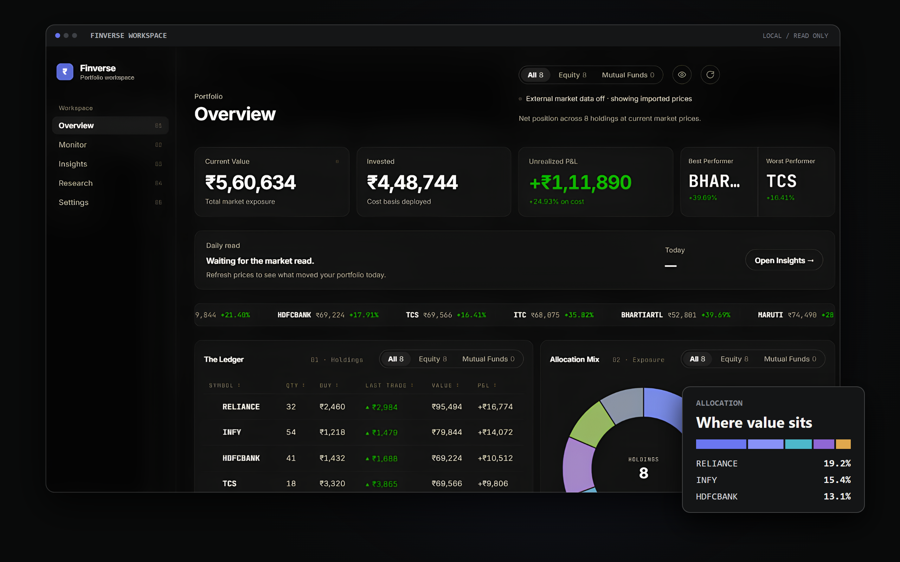
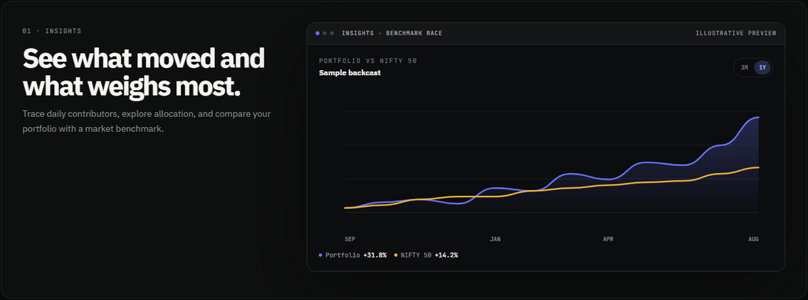

<div align="center">
  

  <h1>Finverse</h1>

  <p><strong>Know what you own. See what moves.</strong></p>
  <p>A private workspace for equities, ETFs, and mutual funds. Import holdings, inspect allocation and P&L, and trace daily moves to the positions behind them.</p>

  <p>
    <a href="#what-you-can-do">Explore features</a> ·
    <a href="#get-started">Get started</a> ·
    <a href="#your-data">Your data</a>
  </p>
</div>



<p align="center"><sub>Illustrative portfolio overview with sample holdings.</sub></p>

## What you can do

- **See the whole portfolio.** View current value, invested capital, P&L, holdings, and allocation across separate folios.
- **Find what changed.** Trace daily movers to individual holdings and inspect price or NAV history.
- **Put performance in context.** Explore concentration and risk, then compare your portfolio with a market benchmark.
- **Follow your holdings.** Filter portfolio news and open research links for the instruments you own.
- **Download your data.** Import `.xlsx`, `.xls`, or `.csv` holdings files, then export a CSV copy or a JSON archive.



<p align="center"><sub>Illustrative insights preview. Chart values are sample data.</sub></p>

## Get started

You need Node.js and npm. From the repository root:

```bash
npm ci
npm run dev
```

Open the local URL printed by Vite, then choose **Open Finverse**. Import a holdings export to create your first folio. You can review each file before saving it, and each accepted file becomes a separate folio.

Run `npm run build` to check the TypeScript code and create a production build.

## Your data

Finverse stores holdings and preferences in your browser. External market data is off by default; turning it on sends instrument identifiers to market data providers for quotes, history, and news. The optional AI assistant sends portfolio context and chat messages to the provider you configure. Its API key stays in the browser tab's session storage.

Historical backcasts apply **today's holdings** to past prices, so they do not represent past trades. Tracked history starts when daily portfolio snapshots begin accumulating on this device.

Clearing browser data removes your local portfolio and tracked history. Keep your original holdings files if you want to set up Finverse in another browser; the app does not currently import its JSON export.
